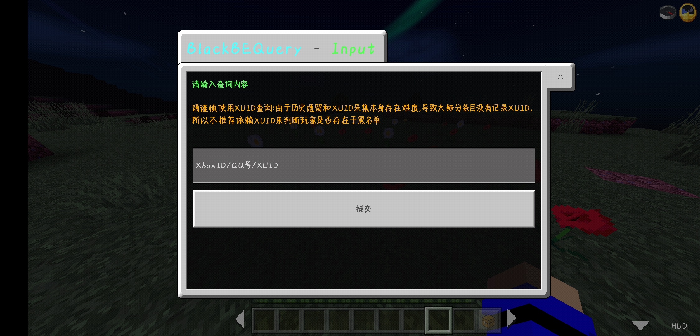
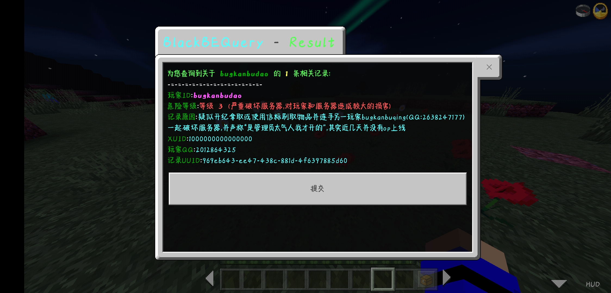

# BlackBEQuery

Version: 1.0.1

Author: [student_2333](https://github.com/lgc2333)

BlackBE 站长：NyanCatda [云黑官网](https://blackbe.xyz) [赞助云黑](https://afdian.net/@BlackBE)

## 插件介绍

插件对接 BlackBE OpenAPI 3.0 实现插件所有功能

本插件是本人写的[BlackBE](https://github.com/lgc2333/BDSPyRunnerPlugins/tree/main/BlackBE)插件的查询功能在 LLSE 的复刻，可以实现在服务器内查询公有库~~或你的私有库~~的违规记录

_注：LLSE 暂不支持 GET 请求带 Headers，所以暂不实现查询私有库._

使用方法：`/blackbe [XboxID/QQ号/XUID]` ，如不带参数则打开输入查询内容表单

## 图骗欣赏

## 安装方法

- 将 `BlackBEQuery.lxl.js` 文件放入 `BDS根目录/plugins` 文件夹内

## 更新日志

- 2022.2.17
  - First Release
- 2022.2.18
  - Reformatted code
  - Some little changes
