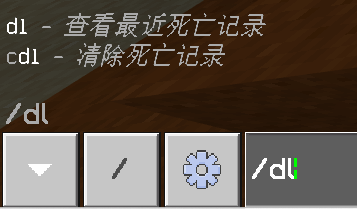
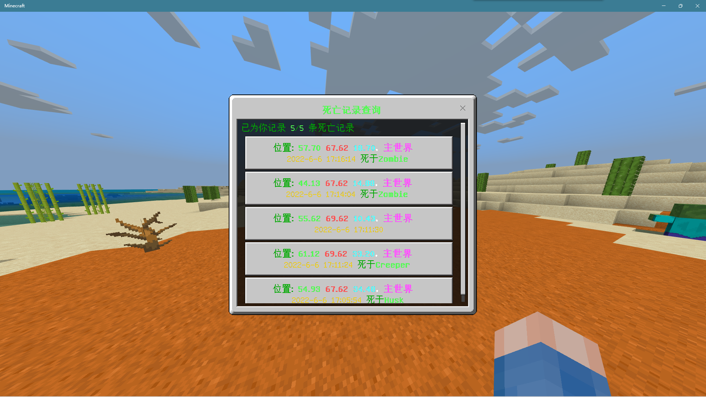
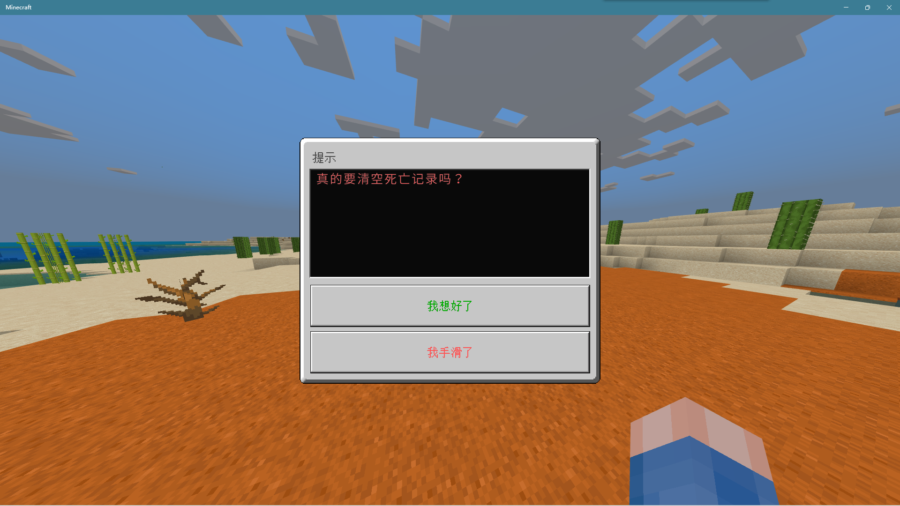

<!-- markdownlint-disable MD031 MD033 MD036 -->

# DeathQuery

死亡记录查询  
[鸣谢](#鸣谢)

## 介绍

### Features

- 死亡时播报  
  
- 查询、清空、记录（可以自定义上限）
  - 命令  
    
  - 简化的命令  
    
  - 查询界面  
    
  - 详细信息、伤害来源记录（如果有）  
    
  - 清空记录  
    

如果你想给这个插件提建议的话，欢迎在 github 提 issue！

## 安装方法

见[插件下载安装教程](../tutorial.md)  
老旧的 LL 版本加载`DeathQuery.lxl.js`报错的，可以使用`DeathQuery_OldLXL.lxl.js`

## 配置文件

插件配置文件位于`BDS根目录/plugins/DeathQuery/config.json`（插件加载成功后自动生成）  
请根据下面 json 中的注释修改配置文件

```jsonc
{
  // 记录数上限（上限无法关闭）
  "maxRecords": 5
}
```

## 鸣谢

感谢 Tech Sky City 服务器腐竹的支持和玩家的试用与反馈！  
TSC 是一个 1.18.2 基岩版的生电服务器  
安装有 Trapdoor，FakePlayer 等插件  
服务器规则原汁原味，死亡掉落、没有传送指令……  
如果你有兴趣想加入他们，点击[这里](https://jq.qq.com/?_wv=1027&k=p2ke7c5F)

## 联系我

QQ：3076823485  
吹水群：[1105946125](https://jq.qq.com/?_wv=1027&k=Z3n1MpEp)  
邮箱：<lgc2333@126.com>

## 赞助

感谢大家的赞助！你们的赞助将是我继续创作的动力！

- [爱发电](https://afdian.net/@lgc2333)
- <details>
    <summary>赞助二维码（点击展开）</summary>

  

  </details>

## 更新日志

- 0.1.1
  - 修复指令权限
- 0.1.2
  - 修复显示的日期少了一个月的 bug
- 0.1.3
  - 修复天数显示错误
