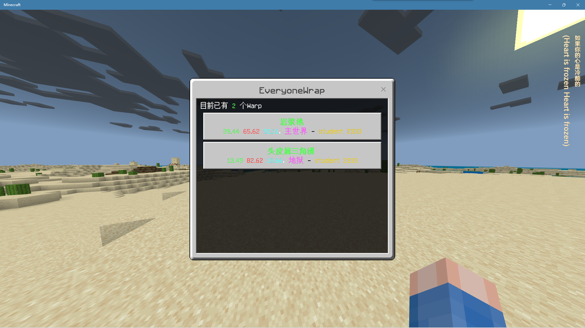
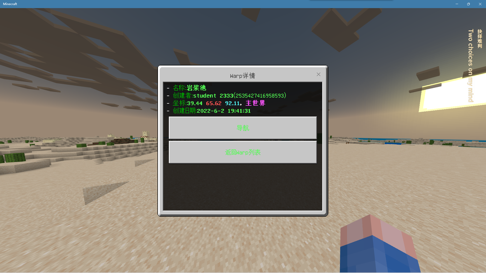
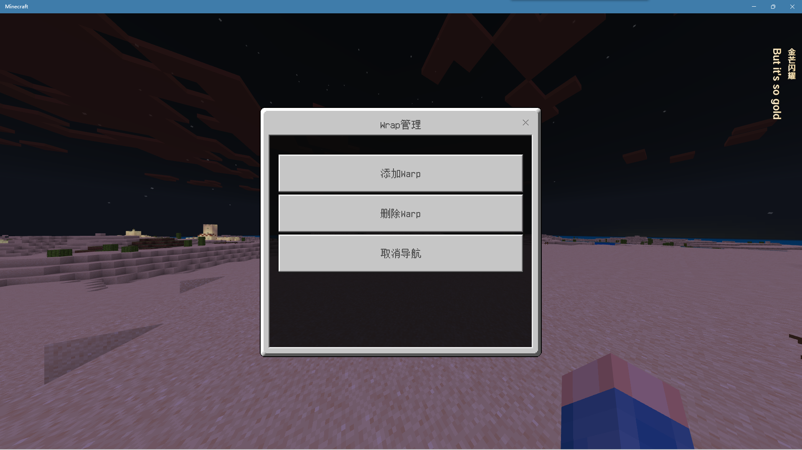
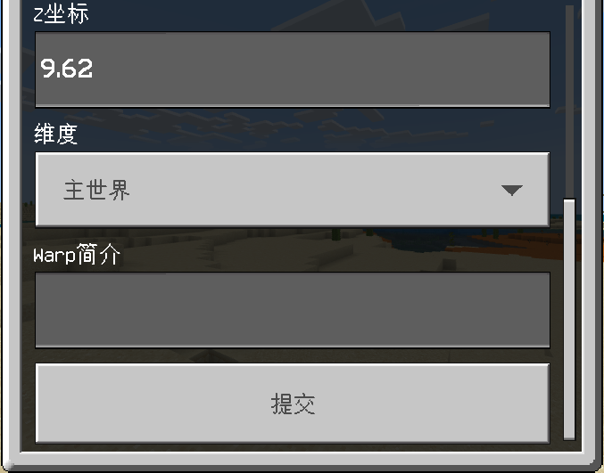
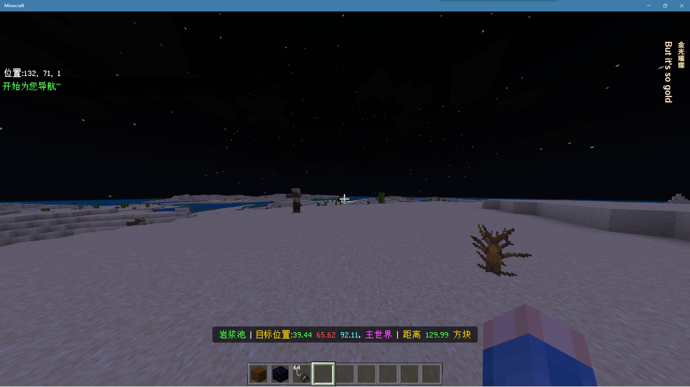

<!-- markdownlint-disable MD031 MD033 MD036 -->

# EveryoneWarp

玩家公共传送点  
[鸣谢](#鸣谢)

## 介绍

### Features

- 所有玩家都可以添加 Warp
- Warp 无法传送，纯生存服务器首选
- 独特的导航功能
- 玩家只能删除他们自己创建的 warp，OP 可以任意删除
- Warp 没有防重名机制

### Pictures

  
  
  
  
  
  
  

如果你想给这个插件提建议的话，欢迎在 github 提 issue！

## 安装方法

见[插件下载安装教程](../tutorial.md)  
老旧的 LL 版本加载`EveryoneWarp.lls.js`报错的，可以使用`EveryoneWarp_OldLXL.lls.js`

插件前置我已经上传到我自己的服务器，加载时即可**自动安装**  
如遇安装失败请移步 [NavigationAPI](../NavigationAPI) 自行下载安装

## 更新[`NavigationAPI`](../NavigationAPI)的方法

如果是自动下载的依赖，请删除`plugins/lib/NavigationAPI.lls.js`文件来更新！（旧版请删除`plugins/lib/NavigationAPI_OldLXL.lls.js`）

## 配置文件

插件没有配置文件

## 鸣谢

感谢 Tech Sky City 服务器腐竹的支持和玩家的试用与反馈！  
TSC 是一个 1.18.2 基岩版的生电服务器  
安装有 Trapdoor，FakePlayer 等插件  
服务器规则原汁原味，死亡掉落、没有传送指令……  
如果你有兴趣想加入他们，点击[这里](https://jq.qq.com/?_wv=1027&k=p2ke7c5F)

## 联系我

QQ：3076823485  
吹水群：[1105946125](https://jq.qq.com/?_wv=1027&k=Z3n1MpEp)  
邮箱：<lgc2333@126.com>

## 赞助

感谢大家的赞助！你们的赞助将是我继续创作的动力！

- [爱发电](https://afdian.net/@lgc2333)
- 

    
赞助二维码（点击展开）

  

  

## 更新日志

- 0.1.1
  - 修复玩家退服时候导航未关闭
  - 修复`EveryoneWarp_OldLXL.lls.js`能同时启动两个导航
- 0.1.2
  - 修复指令权限
- 0.1.3
  - 修复错误的命名（`wrap`->`warp`）
  - 导航加入地狱、主世界维度坐标换算
- 0.1.4
  - 修复显示的日期少了一个月的 bug
- 0.2.0
  - 将导航功能独立出一个前置插件[`NavigationAPI`](../NavigationAPI)
    - 修复了在末地时显示坐标换算的 Bug
  - 加入了 Warp 的简介，创建时可以设置
  - Warp 创建时可以自定义坐标、维度了
  - 更改部分提示文本
  - 修复删除 Warp 时的某些 Bug
  - Warp 详情界面加入删除按钮（只有该 Warp 的创建者和 OP 会显示）
  - 现在无需停止导航即可建立另一个导航
  - **2022.7.28 更新**
    - 适配旧版 lxl
    - [`NavigationAPI` Bug 修复](../NavigationAPI/README.md#更新日志)
- 0.2.1
  - 修复天数显示错误
