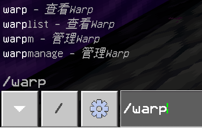
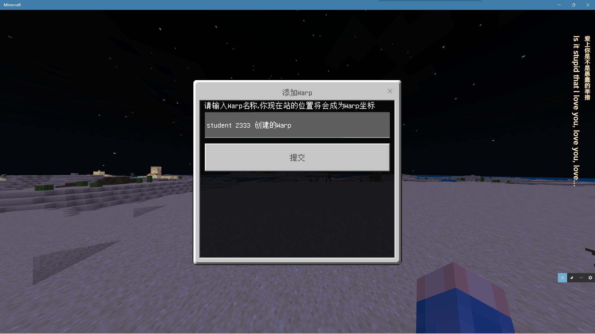
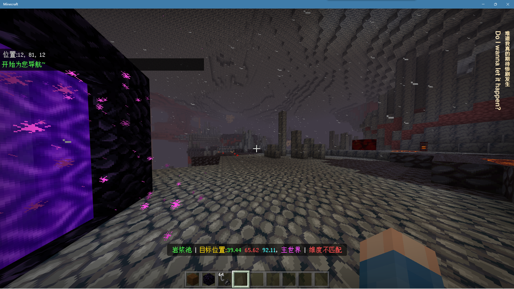

<!-- markdownlint-disable MD031 MD033 MD036 -->

# EveryoneWrap

玩家公共传送点  
感谢腐竹 **Z.**（2775497761） 给出的开发建议~

## 介绍

### Features

- 所有玩家都可以添加 Warp
- Warp 无法传送，纯生存服务器首选
- 独特的导航功能
- 玩家只能删除他们自己创建的 wrap，OP 可以任意删除
- Warp 没有防重名机制

### Pictures

  
  
  
  
  

如果你想给这个插件提建议的话，欢迎在 github 提 issue！

## 安装方法

见[插件下载安装教程](tutorial.md)  
老旧的 LL 版本加载`EveryoneWrap.lls.js`报错的，可以使用`EveryoneWrap_OldLXL.lls.js`

## 配置文件

插件没有配置文件

## 更新日志

- 0.1.1
  - 修复玩家退服时候导航未关闭
  - 修复`EveryoneWrap_OldLXL.lls.js`能同时启动两个导航
- 0.1.2
  - 修复指令权限
