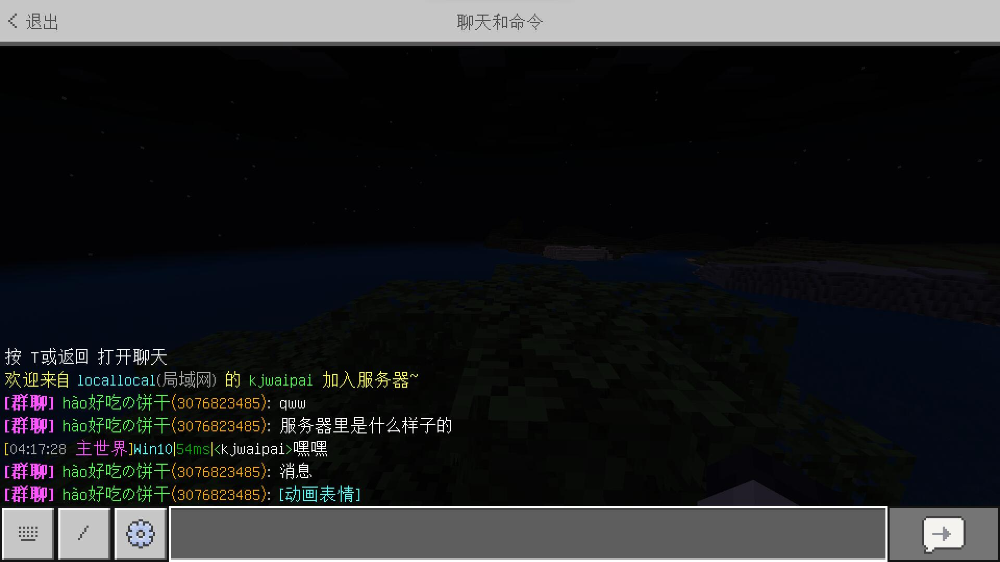
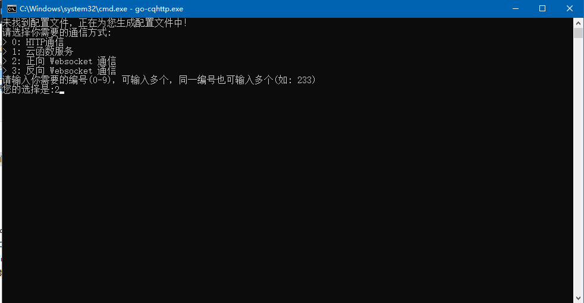
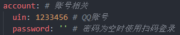
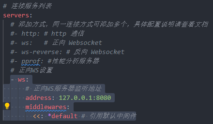
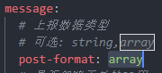
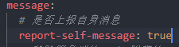
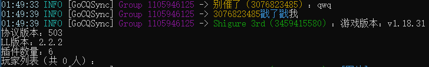

<!-- markdownlint-disable MD031 MD033 -->

# GoCQSync

一个依赖 [GoCQHTTP](https://github.com/Mrs4s/go-cqhttp) 的群服互通插件

## 介绍

本插件通过与 GoCQ 的正向 ws 通信来实现群服互通的功能

### 特点

- 直接与 GoCQ 通信，除 GoCQ 外不依赖其他插件、程序等
- 简洁，没有冗余功能

### 功能

- QQ 群消息与服务器互通
  - 群聊消息转给服务器时会将特殊消息转义，如`[图片]`
  - 玩家进退服提醒
- QQ 群内执行控制台指令
- 戳一戳获取服务器状态

### 效果图

<details>
  <summary>点击展开</summary>




</details>

### 缺点

- 受 LLSE 接口制约，插件容易出 bug（也可能是我的锅（悲））

## 配置

1. 配置 GoCQ
   1. 如果你还没用过 GoCQ，请去[这里](https://github.com/Mrs4s/go-cqhttp/releases)下载你对应系统架构的 GoCQ  
      （例：64 位 amd 架构处理器的 windows 系统就下载 `go-cqhttp_windows_amd64.zip`）
      1. 启动 GoCQ
      2. 当让你选择你所需要的通信方式时，请选择正向 ws，其他按需选择  
         
      3. 修改`config.yml`中的账号密码为机器人 QQ 的  
         
   2. 修改`config.yml`配置文件
      1. 如果你之前没选过正向 ws 的连接方式，直接在配置文件`servers`项后面加上这样一段即可  
           
         下面是配置内容，复制粘贴即可，注意左侧缩进（建议使用 vscode，粘贴时可以自动控制缩进）
         ```yml
         - ws:
           address: 127.0.0.1:8080
           middlewares:
             <<: *default
         ```
      2. 按需修改 ws 监听地址  
         正向 ws 连接服务配置的`address`项即为监听地址，冒号前为监听 IP 地址，冒号后为监听端口
         ```yml
         #   ↓IP    ↓端口
         127.0.0.1:8080
         ```
         监听端口可以按需修改  
         监听 IP 地址最好不要设为`0.0.0.0`，因为插件连接时无法使用`access token（访问密钥）`（llse 无法发出带请求头的 ws 连接，且貌似 GoCQ 不支持 ws 连接时 get 参数提供的 access token），这样将会允许外网连接你的 GoCQ（防火墙/安全组规则允许的情况下）  
         当监听 IP 地址设置为`127.0.0.1`时将只允许内网连接，可以保证安全性
      3. 将`message`项下的`post-format`修改为`array`（插件正常处理消息需要用到）  
         
      4. （可选）将`message`项下的`report-self-message`修改为`true`
           
         修改后服务器控制台将会显示机器人自身发出的消息  
         
2. 按照[配置文件](#配置文件)一节修改插件配置
3. 配置完成，Enjoy！

## 配置文件

插件配置文件位于`BDS根目录/plugins/GoCQSync/config.json`（插件加载成功后自动生成）  
请根据下面 json 中的注释修改配置文件

```jsonc
{
  // 连接GoCQ正向ws的url：String
  // 一般情况下与GoCQ配置项保持一致，前面加上 ws:// 即可
  "ws_url": "ws://127.0.0.1:6700",

  // 管理员列表：Array<String>
  // 管理员可以用“/”开头的消息来执行控制台指令
  // 别问为什么用string，问就是llse的锅 (https://github.com/LiteLDev/LiteLoaderBDS/issues/456)
  "superusers": ["1234567890"],

  // 启用群聊：Array<String>
  // 游戏内的聊天消息、进服退服提示都会发送到这些群聊
  // 同时只有这些群聊才会响应戳一戳查看服务器状态以及执行控制台指令等操作
  "enable_groups": ["987654321"],

  // 日志输出等级：Number
  // 见 https://docs.litebds.com/#/zh_CN/Development/ScriptAPI/Logger?id=%e6%a6%82%e5%bf%b5%ef%bc%9a%e5%85%b3%e4%ba%8e%e6%97%a5%e5%bf%97%e8%be%93%e5%87%ba%e7%ad%89%e7%ba%a7
  // 本插件只会输出 ERROR INFO DEBUG 等级的日志，一般情况保持默认即可
  "log_level": 4
}
```

## 贡献

请**不要**直接在 MineBBS 帖子讨论区向我提供建议，因为我不常上论坛，请使用下面提到的方式

插件目前处于早期开发阶段，各种功能都还不太完善，所以欢迎积极提出建议！  
欢迎在本仓库提出 issue，或者提交 pr 来完善插件！  
也欢迎用下面的[联系方式](#联系我)直接联系我！

## 联系我

QQ：3076823485  
吹水/通知群：[1105946125](https://jq.qq.com/?_wv=1027&k=Z3n1MpEp)  
邮箱：<lgc2333@126.com>

## 赞助

感谢大家的赞助！你们的赞助将是我继续创作的动力！

- [爱发电](https://afdian.net/@lgc2333)
- <details>
    <summary>赞助二维码（点击展开）</summary>

  

  </details>

## 更新日志

- 0.1.1
  - 修复部分文本显示错误
  - 添加进服退服提示
- 0.1.2
  - bugfix
- 0.1.3
  - 报错优化
- 0.2.0
  - 修修补补小细节
  - 优化控制台日志输出
- 0.2.1
  - 支持配置日志输出等级
  - 优化重连
- 0.2.2
  - 弃用监控连接状态进程（别问我为什么，问就是有 bug）

## 文档待完善 (\*σ´∀`)σ
