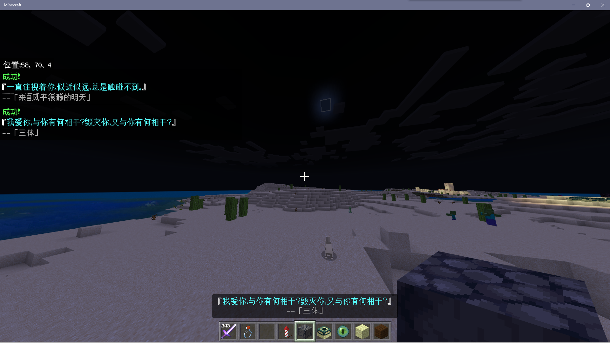
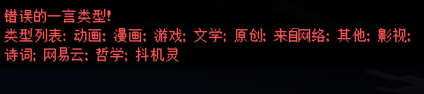
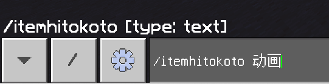

<!-- markdownlint-disable MD033 -->

# ItemHitokoto

将一条「一言」命名到你喜欢的物品上吧！  
[鸣谢](#鸣谢)

## 图片展示

  
  

## 使用

插件只会修改物品显示名称，其他 NBT 都不会修改，大家可以放心使用

### 指令

- `/itemhitokoto [句子类型]`
  - `句子类型` - _可选参数_  
    可用值：  
    `动画`（`a`）  
    `漫画`（`b`）  
    `游戏`（`c`）  
    `文学`（`d`）  
    `原创`（`e`）  
    `来自网络`（`f`）  
    `其他`（`g`）  
    `影视`（`h`）  
    `诗词`（`i`）  
    `网易云`（`j`）  
    `哲学`（`k`）  
    `抖机灵`（`l`）

## 安装

见[插件下载安装教程](../tutorial.md)

## 配置文件

插件没有配置文件

## 鸣谢

感谢 [Hitokoto](https://hitokoto.cn/) 提供的一言接口

感谢 Tech Sky City 服务器腐竹的支持和玩家的试用与反馈！  
TSC 是一个 1.18.2 基岩版的生电服务器  
安装有 Trapdoor，FakePlayer 等插件  
服务器规则原汁原味，死亡掉落、没有传送指令……  
如果你有兴趣想加入他们，点击[这里](https://jq.qq.com/?_wv=1027&k=p2ke7c5F)

## 联系我

QQ：3076823485  
吹水群：[1105946125](https://jq.qq.com/?_wv=1027&k=Z3n1MpEp)  
邮箱：<lgc2333@126.com>

## 赞助

感谢大家的赞助！你们的赞助将是我继续创作的动力！

- [爱发电](https://afdian.net/@lgc2333)
- 

    
赞助二维码（点击展开）

  

  

## 更新日志

- 1.0.1
  - 增加指令别名`ithito`
  - 增加旧版 lxl 支持
