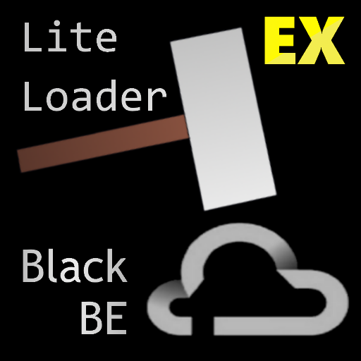

<!-- markdownlint-disable MD033 MD041 -->

<div align="center">
  

# LLBlackBEEx

</div>

[LxlBlackBE](https://www.minebbs.com/threads/lxlblackbe.7482/)的改进版，全部改用真命令注册，并且加入了私有库支持与游戏内查询（移植自[BlackBEQuery](https://github.com/lgc2333/LLSEPlugins/tree/main/BlackBEQuery)）

BlackBE 站长：NyanCatda [云黑官网](https://blackbe.xyz) [赞助云黑](https://afdian.net/@BlackBE)

**新 nodejs 版插件开发中，旧版本插件文件请在 [v0](./v0) 文件夹中寻找**

## 指令列表

|                      指令                       |      权限      |                        介绍                         |
| :---------------------------------------------: | :------------: | :-------------------------------------------------: |
| /ban <玩家名> \[封禁原因\] \[封禁时长（分钟）\] | 管理员、控制台 | 将一名玩家加入本地黑名单 / 更新一名玩家的黑名单信息 |
|                 /unban <玩家名>                 | 管理员、控制台 |             将一名玩家从本地黑名单移除              |
|                    /banlist                     | 管理员、控制台 |                 查看本地黑名单列表                  |
|              /blackbe \[查询内容\]              |  玩家、管理员  |            查询云端黑名单（包括私有库）             |

## 安装方法

见[插件下载安装教程](../tutorial.md)

## 配置文件

插件配置文件位于`BDS根目录/plugins/LLBlackBEEx/config.json`（插件加载成功后自动生成）  
请根据下面 json 中的注释修改配置文件

```jsonc
{
  // 你在BlackBE用户中心获取到的APIToken，用于私有库查询
  "apiToken": "",

  // 是否通过IP封禁玩家
  "banIp": 1,

  // 是否隐藏玩家通过黑名单检测日志
  "hidePassMessage": 0,

  // 是否禁用入服 BlackBE 云端黑名单检测
  "disableBlackBE": 0,

  // 当玩家在本地黑名单内时踢出显示的文本
  // 可用变量：
  // %ENDTIME% 解封时间
  // %REASON% 封禁原因
  "kickByLocalMsg": "§c您已被服务器封禁§r\n\n解封时间: §g%ENDTIME%§r\n封禁原因:§g %REASON%",

  // 当玩家在BlackBE中存在违规记录时踢出显示的文本
  // 无可用变量
  "kickByCloudMsg": "§c您已被BlackBE云端黑名单封禁\n\n详情请访问 §6https://blackbe.xyz/",

  // 是否使用BlackBEAPI镜像站（blackbe.lgc2333.top）
  "useMirrorBlackBEUrl": 0
}
```

## 联系我

QQ：3076823485  
吹水群：[1105946125](https://jq.qq.com/?_wv=1027&k=Z3n1MpEp)  
邮箱：<lgc2333@126.com>

## 赞助

感谢大家的赞助！你们的赞助将是我继续创作的动力！

- [爱发电](https://afdian.net/@lgc2333)
- <details>
    <summary>赞助二维码（点击展开）</summary>

  

  </details>

## 更新日志

- 0.1.1
  - 修复`ban`指令参数问题
  - 修复可能的 ip 封禁 bug
- 0.1.2
  - 修复关于 BlackBE 的一些 bug
- 0.1.3
  - 更新`disableBlackBE`配置用于禁用入服`BlackBE`违规记录检测
- 0.1.4
  - 修复 BlackBE 检测失败问题
  - 新增`useMirrorBlackBEUrl`配置项，如果 BlackBE 依然检测失败可以试试开启这个
- 0.1.5
  - 修复天数显示错误
- 0.1.6
  - 不检测模拟玩家
- 0.1.7
  - 更新 API 地址到 blackbe.work
- 0.2.0
  - (#4) 添加管理员本地封禁表单

## 文档待完善，插件写得急，来不及写文档了，赶紧发出来给大家用用嘛 qwq
