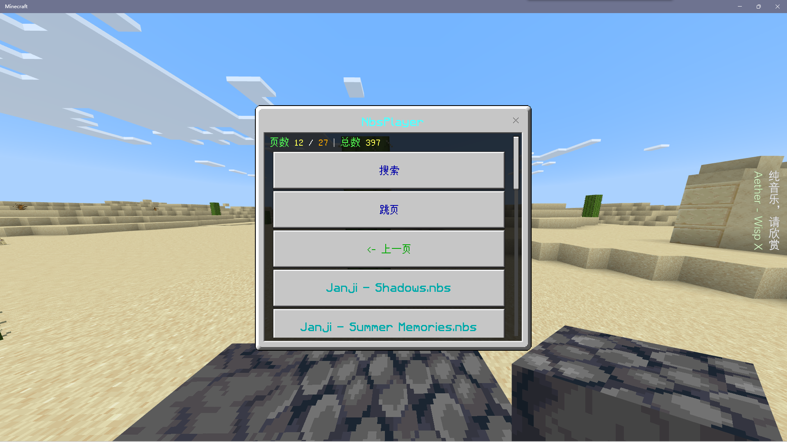
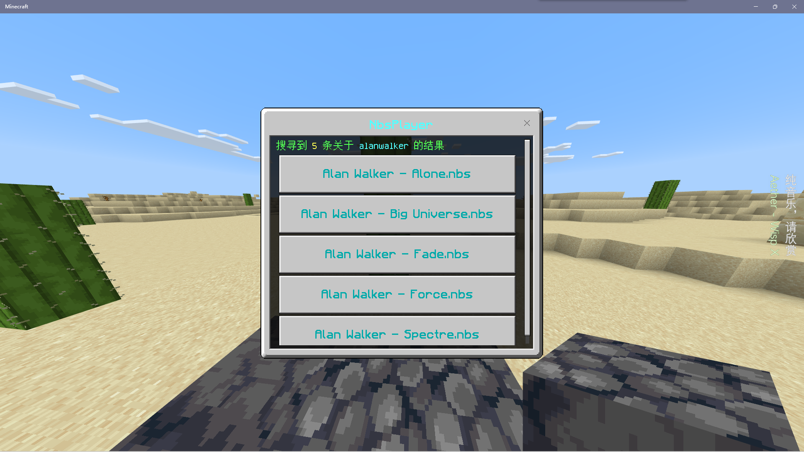
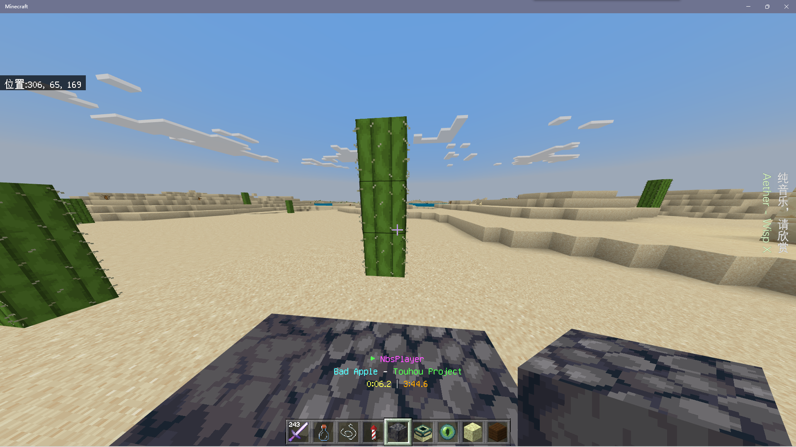
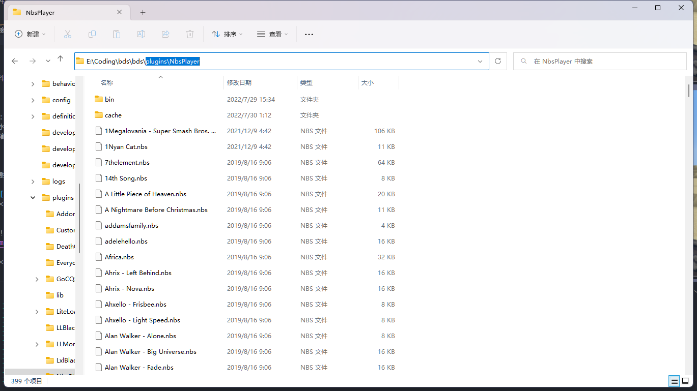

<!-- markdownlint-disable MD033 -->

# NbsPlayer

BDS 中的 NBS 音乐播放器！  
下载插件请去[Releases](https://github.com/lgc2333/LLSEPlugins/releases)

## 介绍

### 运作原理

1. 插件通过[NBS.js](https://github.com/Encode42/NBS.js)解析 nbs 文件
2. 通过`setInterval`设置循环执行函数获取当前时间来对时，根据经过时间生成`PlaySoundPacket`数据包发送给客户端

### 特点

- 支持 单音符/轨道/音色 的音高、音量等设置，单音符的精细调音
- 支持超过两个八度限制的音符
- 支持自定义音色
  - 请将自定义音色的文件名称设置为`playsound`命令可以播放的声音 ID，例：`dig.stone.ogg`，支持资源包自定义的音色
    

### 缺点

- 播放效果不好，会有小卡顿（对不上拍）（脚本语言 / 同步调用 BDS API 效率问题？）
- 无法实现左右声道偏离（~~`playsound`局限~~ 无法实现精细偏移，干脆不做了）
- 稍微动一下视角声道就会偏（`playsound`局限）
- 不支持 layer 独奏（懒）
- 不支持 loop（懒）
- 插件 ~~没有经过深度测试，~~ 可能会有小 bug

### 截图

  
  
  

### 指令

#### `nbsplayer` - 打开插件菜单 / 播放指定音乐

- 格式：`nbsplayer [filename: text]`
- 参数：
  - `filename` - *（可选）*欲播放的文件名
- 权限：所有人
- 限制：只能由玩家以及`execute`命令执行

#### `nbsplay` - OP 播放指令

- 格式：`nbsplay <player: target> <filename: text> [forcePlay: Boolean]`
- 参数：
  - `player` - 欲执行操作的玩家
  - `filename` - 欲播放的文件名
  - `forcePlay` - *（可选）*是否强制让正在播放音乐的玩家播放此音乐
- 权限：管理员

#### `nbstop` - 停止播放

- 格式：`nbstop`
- 参数：无
- 权限：所有人
- 限制：只能由玩家以及`execute`命令执行

#### `nbsisplaying` - 查询玩家播放状态

- 格式：`nbsisplaying`
- 参数：无
- 权限：所有人
- 限制：只能由玩家以及`execute`命令执行

## 安装

请去 [Releases](https://github.com/lgc2333/LLSEPlugins/releases) 下载最新版插件附件，解压到 bds 的插件目录

## 配置

直接将 nbs 文件放置在插件数据目录即可，无需重启服务器~~，注意文件名不要有特殊字符、中文等，否则可能会出错~~（应该已修复）  
例图：  

## 配置文件

插件没有配置文件

## 联系我

QQ：3076823485  
吹水群：[1105946125](https://jq.qq.com/?_wv=1027&k=Z3n1MpEp)  
邮箱：<lgc2333@126.com>

## 赞助

感谢大家的赞助！你们的赞助将是我继续创作的动力！

- [爱发电](https://afdian.net/@lgc2333)
- 

    
赞助二维码（点击展开）

  

  

## 更新日志

- 0.1.1
  - 修复 nbs 文件名不能为特殊符号或中文的问题
  - 修复无法播放最后一 tick 的音符的 bug
  - 加入音符数量显示
- 0.2.0
  - 换用向客户端发送数据包的方式播放音效
  - NbsConvertor 的运行超时限制为 10s
  - 加入歌曲列表为 0 时的提示，与页数小于 2 无法跳页的提示
  - `nbsplayer`命令加入可选参数`filename`，可以直接指定播放的文件名
  - 加入命令`nbsplay` `nbsisplaying`（[指令列表](#指令)）
- 1.0.0
  - 迁移到 nodejs 插件
  - 更换 nbs 文件解析方式，弃用 `NbsConvertor`
  - 歌曲进度显示方式更换为 boss 条
  - 修复由于我对单音符`pitch`的错误理解导致的音符音高错误
  - 修复玄学的命令方块内目标选择器问题（可能是我命令注册的问题）
  - `nbsplay`指令的有关小 bug
  - 其他问题修复/特性调整（不要问，问就是我忘了）
- 1.0.1
  - 播放性能优化（可能）
  - 修复无法播放最后一个音符的 bug
  - 更改自定义音色的使用方式
