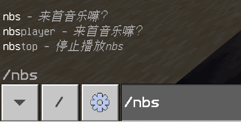

<!-- markdownlint-disable MD033 -->

# NbsPlayer

BDS 中的 NBS 音乐播放器！  
下载插件请去[Releases](https://github.com/lgc2333/LLSEPlugins/releases)

## 介绍

### 运作原理

1. 插件通过[NbsConvertor](NbsConvertor)将 nbs 文件转换成 json 格式存储在 `cache` 目录中
2. 读取 json 数据，通过`setInterval`设置循环执行函数来对时并且根据已播放时间根据 json 内的各数据生成`playsound`命令并执行

### 特点

- 支持 单音符/轨道/音色 的音高、音量等设置
- 支持自定义音色
  - 请将自定义音色的名称设置为`playsound`命令可以播放的声音 ID，例：`dig.stone`，支持资源包自定义的音色

### 缺点

- 播放效果不好，会有小卡顿（对不上拍）（脚本语言 / 调用 BDS 执行命令效率问题？）
- 无法实现左右声道偏离（`playsound`局限）
- 稍微动一下视角声道就会偏（`playsound`局限）
- 插件没有经过深度测试，可能会有小 bug

### 截图

  
  
  
  

## 安装

请去 [Releases](https://github.com/lgc2333/LLSEPlugins/releases) 下载最新版插件附件，解压到 bds 的插件目录

## 配置

直接将 nbs 文件放置在插件数据目录即可，注意文件名不要有特殊字符、中文等，否则可能会出错  
例图：  

## 配置文件

插件没有配置文件

## 联系我

QQ：3076823485  
吹水群：[1105946125](https://jq.qq.com/?_wv=1027&k=Z3n1MpEp)  
邮箱：<lgc2333@126.com>

## 赞助

感谢大家的赞助！你们的赞助将是我继续创作的动力！

- [爱发电](https://afdian.net/@lgc2333)
- 

    
赞助二维码（点击展开）

  

  

## 更新日志

暂无
