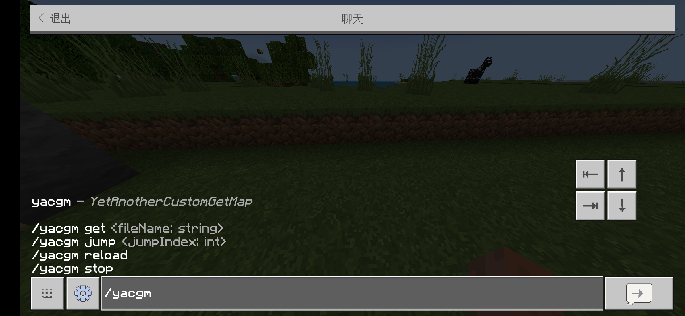
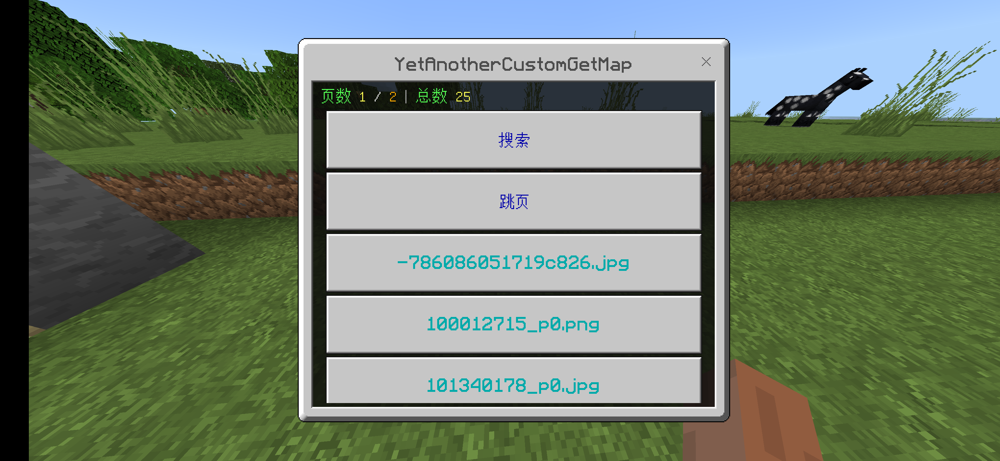
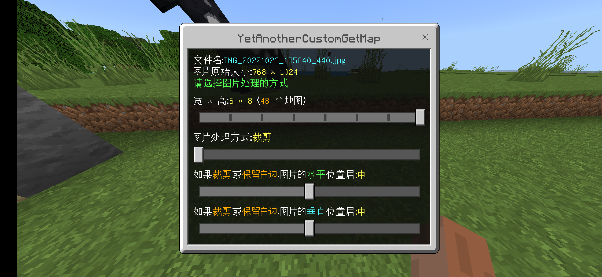
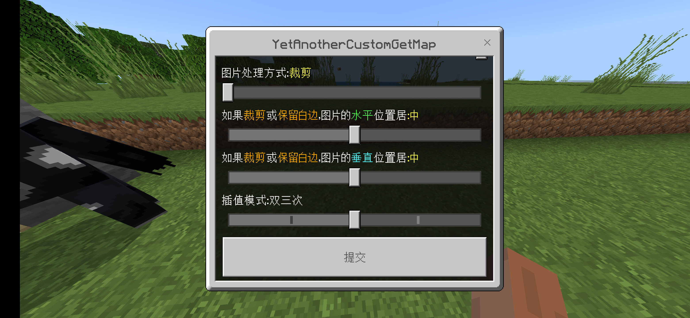

<!-- markdownlint-disable MD033 -->

# YetAnotherCustomGetMap

另一个更易用的 [CustomMap](https://github.com/yhzx233/CustomMap) 辅助插件！  
下载本插件请去 [Releases](https://github.com/lgc2333/LLSEPlugins/releases)

本插件前置：[CustomMap](https://github.com/yhzx233/CustomMap)

## 介绍

插件使用 [Jimp](https://github.com/oliver-moran/jimp) 库来处理图片以及生成地图画二进制文件，**不需要借助其他程序**  
~~但缺点是**处理图片的时候会卡服**~~（该问题已经被解决）  
（性能更好的 [sharp](https://github.com/lovell/sharp) 库会崩服 悲）

插件支持的图片格式：bmp、gif、jpeg、png、tiff，**不支持** webp

直接上截图，顺便介绍一下插件

## 截图

**插件指令**  
YetAnotherCustomGetMap -> YACGM，你也可以在配置文件中更改命令名称  


**图片列表**  


**选择文件后图片处理方式选择表单**  
可选 宽高、处理方式（裁剪/拉伸/保留白边）、处理后水平垂直位置、缩放图片使用的插值法（最近邻/双线性/双三次/埃尔米特/贝塞尔）  
  


**获取地图演示**  
受到 [CustomGetMap](https://www.minebbs.com/resources/customgetmap-custommap.4050/) 插件的启发（因为那个插件一次给全部地图很蛋疼），我把插件的给地图逻辑设计成了当空出主手时才会按顺序给一张，还加上了当前已给予的地图信息的提示，这样当拼一些大地图的时候就不会那么蛋疼了  
如果你搞乱了顺序，可以随时使用 `yacgm jump <地图序号>` 跳转到某一张地图  
  
  


## 使用

1. 先去 [Releases](https://github.com/lgc2333/LLSEPlugins/releases) 下载本插件，放在插件文件夹下，开服
2. 插件加载成功后会在插件文件夹内生成 `YetAnotherCustomGetMap/img` 文件夹，把图片文件放进里面就可以在插件菜单里看到了

当服务端内安装有 YoyoRobot 时，插件会与其对接，并且提供一个新的机器人指令 `上传地图画`  
使用方法见下图  


## 指令

### `yacgm`（这个指令可以在配置文件中修改）

- 不带任何参数 - 打开插件主界面
- `get <fileName:string>` - 直接选择指定的文件，弹出图片处理表单
  - `fileName` - 图片文件名，需要带后缀，文件需要在插件的图片文件夹中；
    当此参数为 `http://`或`https://` 开头的链接时，插件会从该链接获取图片
- `jump <jumpIndex:int>` - 在获取地图的过程中，直接跳转到指定序号的地图
  - `jumpIndex` - 要跳转到的地图序号（序号从 1 开始）
- `stop` - 在获取地图的过程中，停止获取地图
- `reload` - 重载插件配置（必须 OP 才能执行）

## 配置文件

配置文件路径：`plugins/YetAnotherCustomGetMap/config.json`  
请按照下面的注释修改配置文件  
注意：实际配置文件里**不能有注释**！

```jsonc
{
  // 插件指令名称，修改后需要重启服务器
  "mainCommand": "yacgm",

  // 插件菜单每页展示的文件数量
  "pageLimit": 15,

  // 是否需要 OP 才能打开插件主界面
  "mainPageOP": false,

  // 是否需要 OP 才能使用 yacgm get 指令（打开处理图片页面）
  "getPageOP": false
}
```

## 联系我

QQ：3076823485  
吹水群：[1105946125](https://jq.qq.com/?_wv=1027&k=Z3n1MpEp)  
邮箱：<lgc2333@126.com>

## 赞助

感谢大家的赞助！你们的赞助将是我继续创作的动力！

- [爱发电](https://afdian.net/@lgc2333)
- <details>
    <summary>赞助二维码（点击展开）</summary>

  

  </details>

## 更新日志

### 0.2.0

- `yacgm get` 命令可以使用 url 作为参数了
- 对接了 `YoyoRobot`
- 调整了配置文件（见 [配置文件](#配置文件)）
- 解决了处理图片卡服的问题
- 微调了地图画给予完毕时的行为，需要手动输入指令退出给予模式
