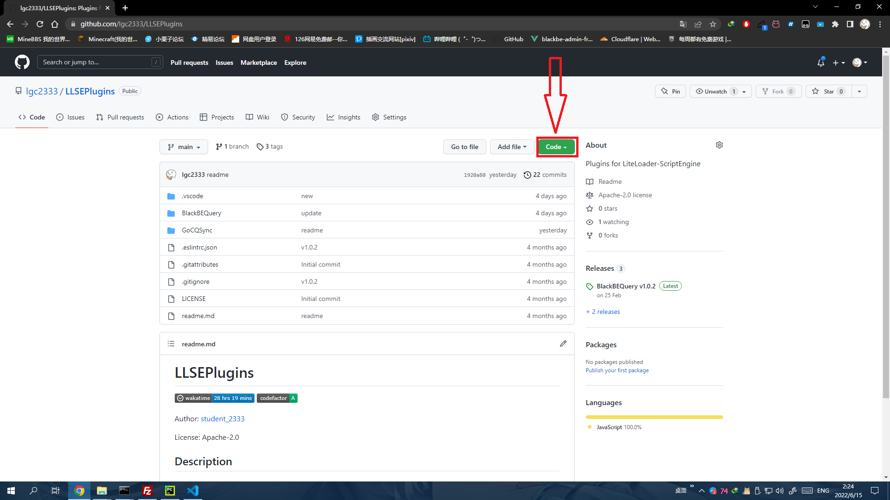
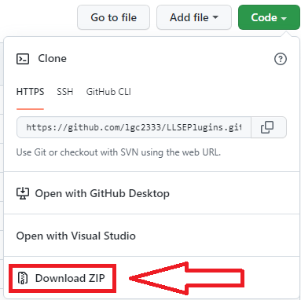
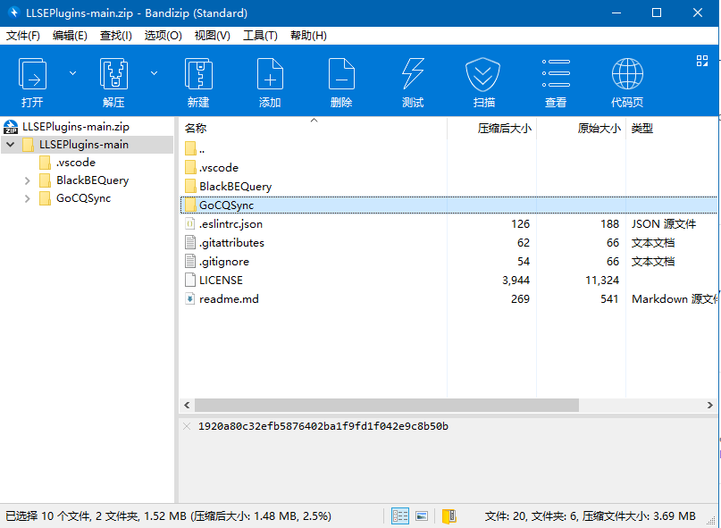
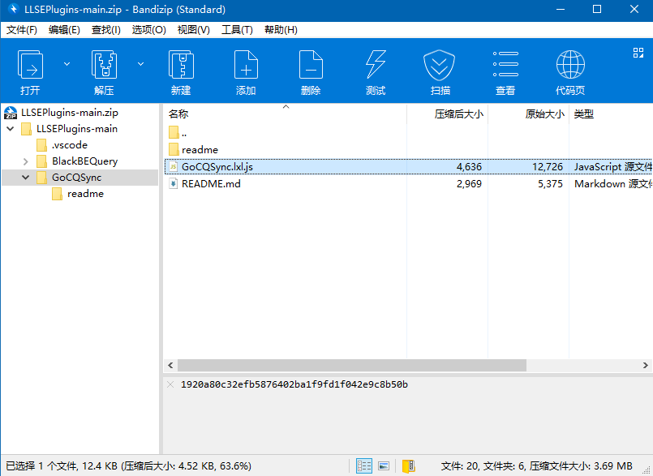
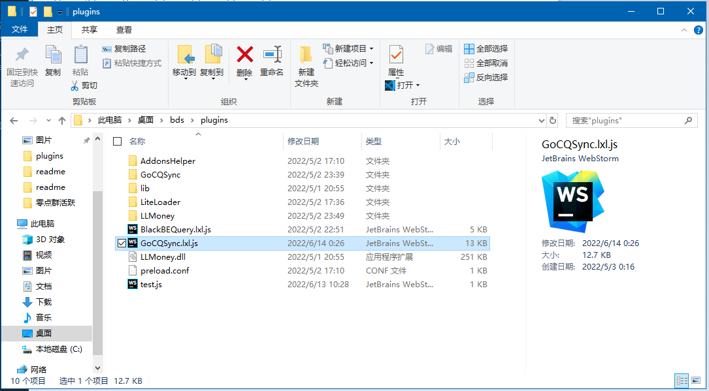
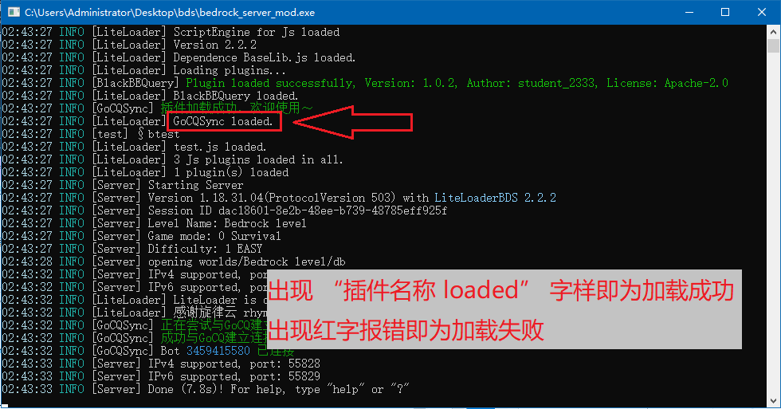

# 插件下载安装教程

既然你都到这来了，那你应该已经有个好用的梯子了吧  
接下来按照下面的教程下载插件安装就好~  
如果你会下面的方法，或者会其他方法（例如使用 Git），那当我没说，就别看了吧

## 教程

1. 在存储库首页点击`Code`按钮  
   
2. 点击`Download ZIP`下载整个存储库  
   
3. 在下载完成的压缩包中找到你想安装的插件名字的文件夹，进入  
   
4. 将文件夹中的`.lxl.js`后缀的插件文件拖到服务端`plugins`文件夹  
     
   
5. 重启服务端或者使用`ll load ./plugins/插件文件名`指令加载插件，如未报错即为加载成功  
   
